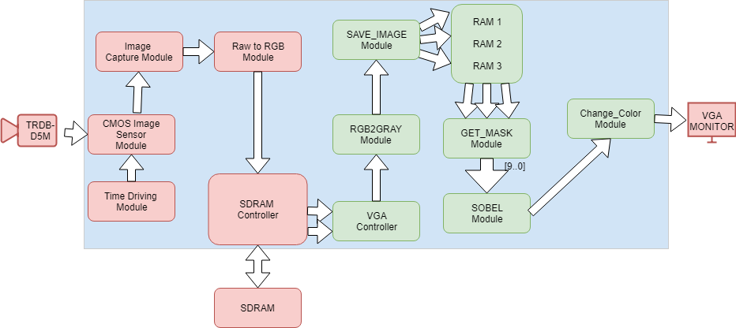

# Real-Time-Sobel-Edge-Detector-in-FPGA
Academic project within the discipline of Digital Systems using a Terasic Altera DE2 Development Board

This project was developped using the Altera Quartus II Software (v9.1 SP2).

It was used the 5MP TRDB-D5M camera module. Then using the Demo project for the camera (provided in the CD of the Board), it was developped some modules to process the image data and perform filtering.

The filtered image is provided using a VGA monitor connected to the board. 

Using the switches and keys of the board, it's possible to change the output data:
> SW[0] - Grey Scale Mode
> SW[1] - Sobel Mode
> Key[2] - Stop Camera
> Key[3] - Stream Mode

